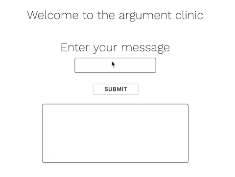

# Argument Clinic



Based off a [Monty Python sketch](https://www.youtube.com/watch?v=ohDB5gbtaEQ), this single page web app will (try to) contradict whatever sentence you say to it. Built in pure javascript prior to starting my bootcamp at Makers. It uses the [datamuse API](https://www.datamuse.com/api/) to find appropriate antonyms, or generates a generic negative response if no antonyms were found.

Try it [on netlify](https://flamboyant-lalande-962373.netlify.com/)

## Run it yourself

#### Mac OS

```sh
$ git clone https://github.com/zi-codes/argument_clinic/
$ cd argument_clinic
```

Open index.html in your favourite web browser.
